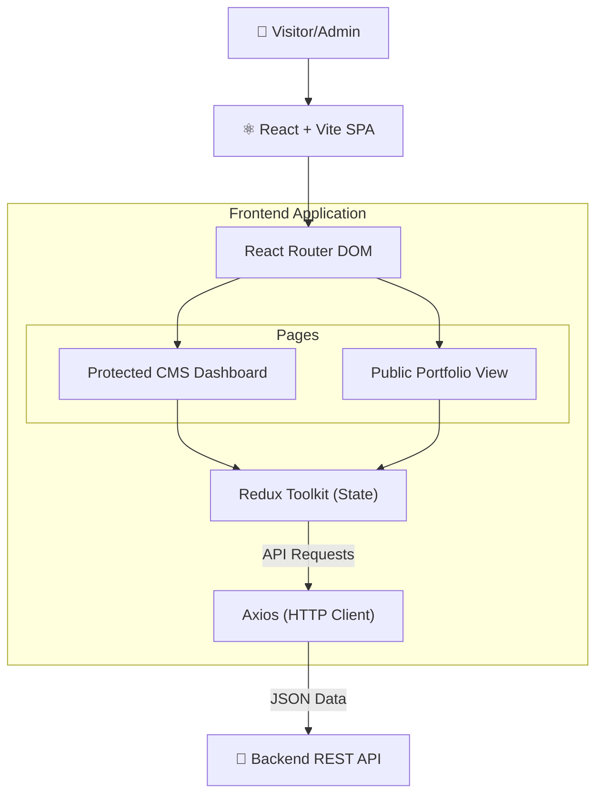

# Portfolio CMS - Frontend

> A beautiful, responsive single-page portfolio with a fully integrated Admin CMS dashboard to manage all content dynamically.


---

## ✨ Features

- 🎨 **Dynamic Portfolio** — Beautiful, modern UI for showcasing projects, skills, blogs, and experience.
- 🎛️ **Admin CMS Dashboard** — A secure, private interface to add, edit, and delete portfolio content.
- 📱 **Fully Responsive** — Mobile-first Tailwind CSS design ensuring perfect layout across all devices.
- 🔄 **State Management** — Robust global state handling using Redux Toolkit.
- 🔔 **Interactive UI** — Smooth toast notifications via `react-hot-toast` and custom modal dialogs.
- ⚡ **Lightning Fast** — Built on Vite for instant HMR and optimized production builds.

---

## 🏗️ System Architecture



---

## 📁 Project Structure

```text
frontend/
├── index.html
├── vite.config.js
├── src/
│   ├── App.jsx                 # Routing logic & Protected routes
│   ├── main.jsx                # React DOM entry point
│   ├── index.css               # Tailwind directives
│   ├── https/
│   │   └── axios.js            # Configured Axios instance with credentials
│   ├── redux/
│   │   ├── store.js            # Redux store configuration
│   │   └── slices/             # Redux slices (projects, skills, auth, etc.)
│   ├── components/
│   │   ├── public/             # Public portfolio sections (Hero, About, etc.)
│   │   ├── layout/             # CMS layout (Sidebar, Navbar)
│   │   └── ...                 # CMS Manager components (Data tables, Modals)
│   └── pages/
│       ├── public/             # Public Home page
│       └── admin/              # Admin CMS views (Dashboard, Login, etc.)
```

---

## ⚡ Quick Start

### 1. Install Dependencies

```bash
cd frontend
npm install
```

### 2. Start the Development Server

```bash
npm run dev
```
The application will launch on `http://localhost:5173`.

---

## 🗺️ Routing Map

| Path | Access | Description |
|------|:------:|-------------|
| `/` | Public | Main portfolio landing page |
| `/admin/login` | Public | CMS authentication portal |
| `/admin` | Protected | CMS Dashboard overview |
| `/admin/projects` | Protected | Manage portfolio projects |
| `/admin/skills` | Protected | Manage technical skills |
| `/admin/blogs` | Protected | Manage blog posts |
| `/admin/media` | Protected | Manage uploaded files and images |
| `/admin/messages`| Protected | View contact form submissions |

---

## 🚀 Deployment (Vercel)

1. Connect your GitHub repository to Vercel.
2. Set the Root Directory to `frontend`.
3. Vercel will automatically detect Vite and run `npm run build`.
4. Ensure you have a `vercel.json` file configured for SPA routing rewrites to `index.html`.
